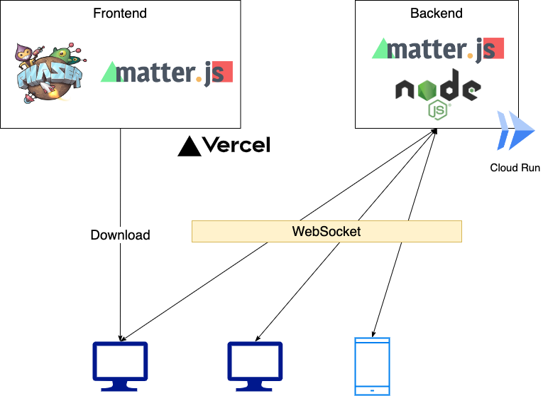

# Bom Bom Panic

[ボムボムパニック](https://bombompanic.vercel.app/)

TODO: gif などを入れたい

## 使用技術

| 種類                     | 使用技術                                                                                                      |
| ------------------------ | ------------------------------------------------------------------------------------------------------------- |
| フロントエンド           | TypeScript                                                                                                    |
| バックエンド             | Node.js / TypeScript                                                                                          |
| ゲームエンジン           | [Phaser3](https://phaser.io/phaser3) / [matter.js](https://brm.io/matter-js/)                                 |
| リアルタイム通信         | [Colyseus](https://www.colyseus.io/)                                                                          |
| デプロイ(フロントエンド) | [Vercel](https://vercel.com/)                                                                                 |
| デプロイ(バックエンド)   | [Cloud Run](https://cloud.google.com/run)                                                                     |
| CI / CD                  | [GitHub Actions](https://github.co.jp/features/actions) / [Cloud Build](https://cloud.google.com/build?hl=ja) |
| ビルド                   | [Vite](https://ja.vitejs.dev/)                                                                                |

## Special Thanks

### 画像

- 背景
  - [Adventure TileSet (Forest) by saintjacky](https://saintjacky.itch.io/adventure-tileset)
- キャラクター
  - [Little Animals Pack by NotMatter](https://notmatter.itch.io/2)
- マップ
  - TODO:
- 爆弾
  - [ぴぽや倉庫](https://pipoya.net/sozai/)
- 爆風
  - [Bomberman Explosion Effect | OpenGameArt.org](https://opengameart.org/content/bomberman-explosion-effect)
- フォント
  - [Press Start 2P - Google Fonts](https://fonts.google.com/specimen/Press+Start+2P)
- ロゴ
  - [ピクセルフォント - ピクセルフォント変換](https://fontmeme.com/ja/font-pixel-style/)
- その他
  - ジョイスティック
    - [stemkoski/HTML-Joysticks](https://github.com/stemkoski/HTML-Joysticks)
  - トロフィー
    - [アニメーション素材１ - ぴぽや倉庫](https://pipoya.net/sozai/assets/animation/animation-material-1/)
  - チップセット
    - [Sprout Lands - UI Pack by Cup Nooble](https://cupnooble.itch.io/sprout-lands-ui-pack?download)
  - 雲
    - [Pixel Art Semi-Realistic Clouds by LateNightCoffee](https://latenightcoffe.itch.io/2d-pixel-art-semi-realistic-clouds?download)

### 音楽

- BGM
  - [しーでんでん ファミコン風 オリジナルフリー BGM ｜ seadenden 8bit freeBGM](https://seadenden-8bit.com/)
  - [ファミコン風　オリジナルフリー BGM seadenden 8bit freeBGM](https://seadenden-8bit.com/)
  - [ファミコン風 BGM/SE リスト | ファミコン風フリー BGM サイト | イワシロ音楽素材](https://iwashiro-sounds.work/)
  - [魔王魂 | 無料で使える森田交一の音楽](https://maou.audio/)
- SE
  - [無料効果音で遊ぼう！](https://taira-komori.jpn.org/index.html)
  - [Game UI sounds | Royalty Free Music - Pixabay](https://pixabay.com/sound-effects/game-ui-sounds-14857/)
